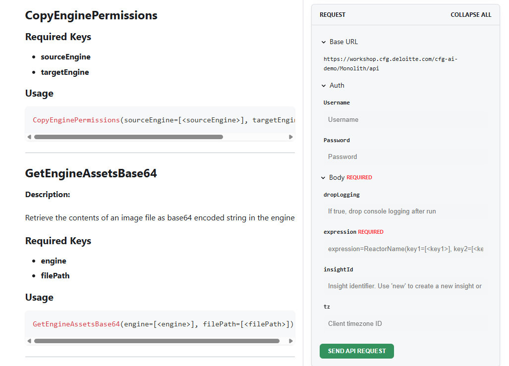

| Software    | Version |
| -------- | ------- |
| Node |  v24.4.0|
| pnpm |  v10.13.x+|


The documentation has been moved into a Docusaurus! 

To reach it navigate to the docusaurus folder and you should see each article in their respective folders there. 

To run this locally. 

```
cd docusaurus
pnpm install
pnpm start
```

this will build a local server on localhost:3000 

If you want to create a new build, you can 

```
pnpm build
pnpm run serve
```

This will show you what it looks like hosted! 

---

## Repository Structure (Planned)

The repository will evolve to follow a structured Docusaurus versioning model.  
Each documentation release will have its own frozen copy of markdown files and static assets, preserving the exact state users saw at that version’s release.

<details>
<summary><strong>Planned Directory Layout</strong></summary>

```bash
docusaurus/
├── docs/                        (editable documentation for the next release)
│
├── versioned_docs/              (frozen documentation for past releases)
│   ├── version-5.0/
│   ├── version-5.1/
│   └── ...
│
├── static/
│   └── versioned/               (version-specific static assets)
│       ├── 5.0/
│       │   ├── img/
│       │   ├── autoImg/
│       │   └── demos/
│       └── 5.1/
│           ├── img/
│           ├── autoImg/
│           └── demos/
│
├── versioned_sidebars/          (sidebars for each version)
│   ├── version-5.0-sidebars.json
│   ├── version-5.1-sidebars.json
│   └── ...
│
├── versions.json                (records all frozen versions)
├── docusaurus.config.js         (site configuration)
└── sidebars.js                  (current version sidebar)
```
</details>

### In Simple Terms

- `/docs/` → This is the editable, “work-in-progress” documentation for the next release.  
- `/versioned_docs/` → Each subfolder here (like `version-5.0/`, `version-5.1/`) is a frozen snapshot of what the docs looked like at that version’s release.  
- `/static/versioned/` → Holds images and demos specific to each version, so nothing breaks when older docs are viewed.  
- `/versioned_sidebars/` → Stores sidebar navigation for each version to match its structure.  
- `versions.json` → Keeps track of which versions exist and appear in the dropdown menu.  
- The **goal** is to make each documentation version self-contained, i.e. if you open version 5.0, you see exactly what users saw when 5.0 was released.

### Versioning Roadmap

Once versioning is enabled, the process will use:

```bash
npx docusaurus docs:version <version>
```

This will:
- Copy `/docs/` into `/versioned_docs/version-<version>/`
- Duplicate static assets under `/static/versioned/<version>/`
- Update `versions.json` and generate a sidebar file for the release
- Keep `/docs/` editable for upcoming changes

Older versions will remain permanently accessible, while the “Current” version under `/docs/` represents work in progress for the next release.

---

*This structure is not yet active but will guide how documentation versions are managed once multi-version support is introduced.*

### Using Docker to test Reactor Try me

This project includes a `Dockerfile` and `docker-compose.yml` to build and run the application and its dependencies in a containerized environment. This is useful for testing the "Try Me" feature for Reactors which requires a backend service.

### Run the Published Documentation Image (Quay)

If you want to run the already-published documentation image from Quay, use the steps below.

1. Create a `.env` file in your current directory. Example:

    ```env
    APP_NAME=AI EU
    MONOLITH_API_URL=http://localhost:8080/ai.eui
    SUPPORT_EMAIL=testsupport@deloitte.com
    ```

2. Pull the latest image:

    ```sh
    sudo docker pull quay.io/semoss/documentation:latest
    ```

3. Run the container:

    ```sh
    sudo docker run --rm -p 3000:3000 --env-file .env quay.io/semoss/documentation:latest
    ```

The documentation app will be available at `http://localhost:3000`.

Note: if your Docker setup does not require `sudo` (for example, Docker Desktop on Windows/macOS), run the same commands without `sudo`.

### Kubernetes and Helm Examples

Example deployment artifacts are available in this repository:

- Kubernetes manifest: `k8s/documentation-app-example.yaml`
- Helm chart: `helm/semoss-documentation/`

The manifest and Helm chart use the same environment variables shown above:

- `APP_NAME`
- `MONOLITH_API_URL`
- `SUPPORT_EMAIL`

Apply the raw manifest:

```sh
kubectl apply -f k8s/documentation-app-example.yaml
```

Install with Helm:

```sh
helm install semoss-documentation helm/semoss-documentation
```

Upgrade with Helm:

```sh
helm upgrade semoss-documentation helm/semoss-documentation
```

#### Prerequisites

For Windows users, it is recommended to use WSL (Windows Subsystem for Linux) to run Docker.

1.  **Install WSL:** Follow the official Microsoft guide to [install WSL](https://learn.microsoft.com/en-us/windows/wsl/install). A distribution like Ubuntu is recommended.

2.  **Install Docker Engine on WSL:** Once you have a Linux distribution running in WSL, open its terminal and follow the official guide to [install Docker Engine](https://docs.docker.com/engine/install/ubuntu/). The `docker-compose-plugin` is included in this installation, which provides the `docker compose` command.

3.  **Start the Docker Daemon:** Before running Docker commands, you may need to start the Docker service within WSL:
    ```sh
    sudo service docker start
    ```

#### Instructions

1.  **Build the Docker image for the frontend:**

    From the `docusaurus` directory, run the following command to build the image. The `docker-compose.yml` file expects the image to be tagged as `semoss-doc:latest`.

    ```sh
    docker build -t semoss-doc:latest .
    ```

2.  **Run the services using Docker Compose:**

    This will start the frontend, backend, and an nginx reverse proxy. The `-d` flag runs the containers in detached mode.

    ```sh
    docker-compose up -d
    ```

    The `nginx` service acts as a reverse proxy to route requests to the appropriate service: the `frontend` documentation site or the `backend` SEMOSS service. This setup serves both applications under the same origin, which resolves potential Cross-Origin Resource Sharing (CORS) issues between them.

    The website will be available at `http://localhost:8080`.

3.  **Run try me Reactors**

    Go to any reactor http://localhost:3000/documentation/developer/Reactors/engine 

    

4.  **Stopping the services:**

    To stop and remove the containers, run:

    ```sh
    docker-compose down
    ```
