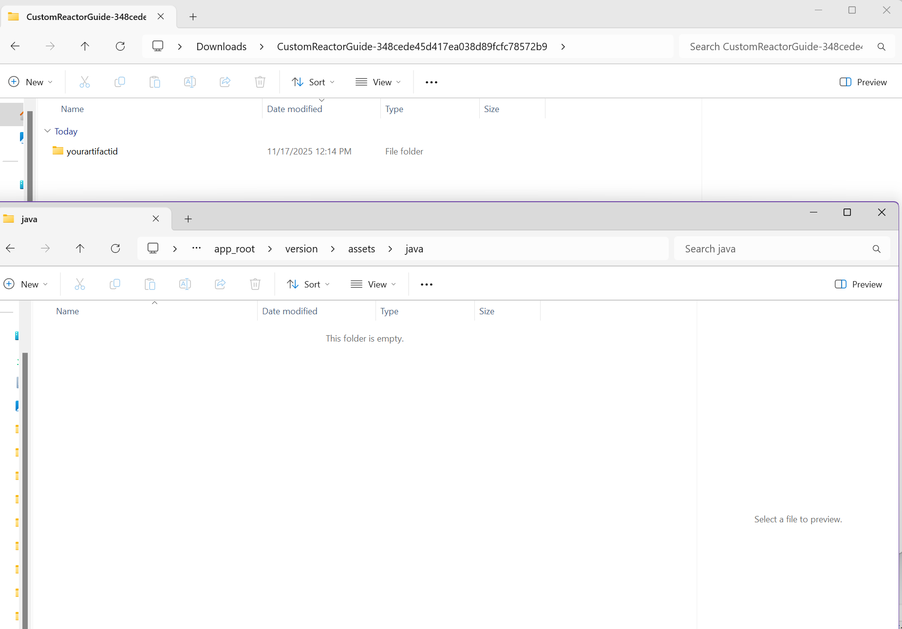
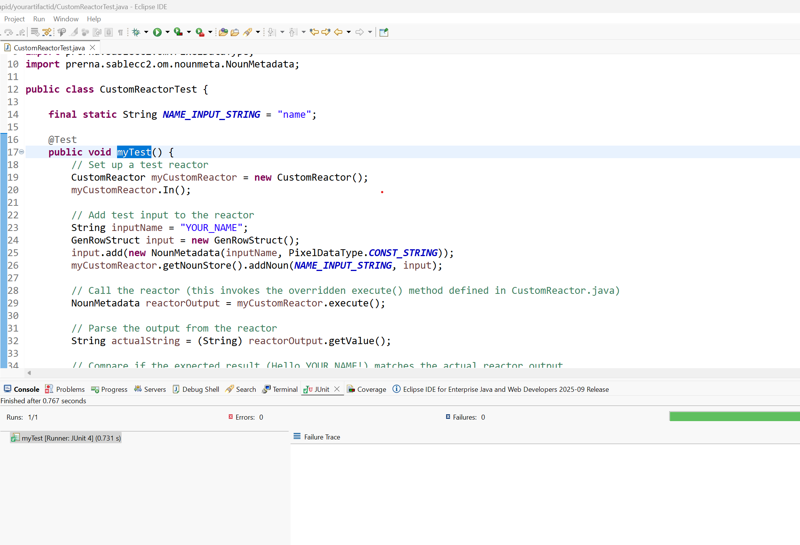

import AppName from "@site/src/components/CustomFields";

# Setting up a maven project
## Overview
SEMOSSName allows you to create your own custom backend files. In this tutorial, we will go through creating a maven project.

## Setup

### Install Maven
**Maven** is a dependency management tool for Java projects. When creating custom reactors, you will borrow classes and methods from a **SEMOSSName** source that SEMOSSName maintains through its [Maven Repository](https://mvnrepository.com/artifact/org.semoss/semoss). 

Please make sure that you have already set up SEMOSSName and installed Maven according to one of the guides below based on your chosen setup type:

* **If you use the public SEMOSSName server or Dockerized SEMOSSName (common)**: [Getting Started: Maven Setup](https://maven.apache.org/guides/getting-started/#:~:text=Sections%201%20What%20is%20Maven%3F%202%20How%20can,8%20What%20is%20a%20SNAPSHOT%20version%3F%20More%20items)
* **If you use a fully local installation***: [Download Required Software](../../Getting%20Started/How%20to%20Access%20SEMOSS.mdx#installation-instructions)

  _*Fully local installations are uncommon and typically only recommended for users who wish to directly modify the SEMOSSName source code._

### Create your package directory structure
<!-- TODO update link to pro code file structure -->
1. To get started, navigate to the `java` folder inside of your app project folder. If you have not created an app project folder yet, please review the project directory structure [here](/How%20To/App%20Creation%20Guides/React%20App%20In-Depth%20Guide#app-structure) first.

2. Create the following unique identifiers using **lowercase a-z characters only**:

   - **Group ID**: This identifier represents your organization/team or who you are.
   - **Artifact ID**: This represents your project name.

     For example, if you work for the Human Resources team and are developing a Staffing App, you could choose "humanresources" as your group ID and "staffingapp" as your artifact ID.

3. Download the starter Maven project from [here](../../../static/assets/CustomReactorGuide.zip)
4. Once it's downloaded, unzip the folder. Open the `CustomReactorGuide` folder. You should see a folder inside it called `yourartifactid`.
5. Move the `yourartifactid` folder into the `java` folder within your project directory.



6. Rename the `yourartifactid` folder to the Artifact ID you chose earlier (ex. "staffingapp"). Make sure you type the name in lowercase a-z only (no spaces, underscores, or dashes).
7. Navigate inside the Artifact ID folder that you just renamed. You should see a `src` folder and a file titled `pom.xml`.
8. Open up `pom.xml` in any text editor to replace any instances of `yourgroupid` and `yourartifactid`. These usually occur around lines 5-8:

  ```
   5 	 <groupId>yourgroupid</groupId>
   6	 <artifactId>yourartifactid</artifactId>
   7	 <version>0.1</version>
   8	 <name>yourartifactid</name>
   ```

   Replace `yourgroupid` on line 5 with the actual group ID you chose in the previous section.
   Replace `yourartifactid` on lines 6 and 8 with the actual artifact ID you chose in the previous section. **Save and close the file.**

   > **Note**
   > If you want to use your own `pom.xml` for your project instead of our starter template, simply add the following snippet to the `dependencies` block:
   
    ```
    <!-- https://mvnrepository.com/artifact/org.semoss/semoss -->
    <dependency>
       <groupId>org.semoss</groupId>
       <artifactId>semoss</artifactId>
       <version>4.2.2</version>
    </dependency>
    ```
 
9. Navigate into the `src/main/java` folder. You should see a folder titled `yourgroupid`
10. Rename the `yourgroupid` folder as the Group ID (ex. "humanresources"). Make sure you type the name in lowercase a-z only (no spaces, underscores, or dashes).
11. Navigate inside the Group ID folder that you just renamed, where you will see another folder named `yourartifactid`. Rename this folder according to the Artifact ID you chose earlier.
12. Return to the `src` folder and navigate into the `src/test/java` folder. Repeat steps 10-11 inside this folder as well.

### Import your Project into your IDE (Recommended)

Most popular IDEs that support Java will also provide Maven extensions and easy workflows to import and build Maven projects. Please check out the following IDE-specific guides on how to **import an existing Maven project** into your preferred IDE.

- [VSCode](https://code.visualstudio.com/docs/java/java-build)
- [Eclipse](https://www.baeldung.com/maven-import-eclipse)
- [JetBrains/IntelliJ IDEA](https://www.jetbrains.com/help/idea/maven-support.html)

## Steps

> **Note**
> In this guide, we will walk through creating a reactor called `CustomReactor`.

### Start with a Reactor Template
1. In your preferred IDE, open up the `java/yourartifactid` folder as your project directory/workspace.
2. View the CustomReactor.java file located at `java/yourartifactid/src/main/java/yourgroupid/yourartifactid/reactor` in your IDE. The first line looks like:

   `package yourgroupid.yourartifactid.reactor;`

   Replace the value of `yourgroupid` and `yourartifactid` with the actual identifiers that you chose in the previous section.

3. View the CustomReactorTest.java file located at `java/yourartifactid/src/test/java/yourgroupid/yourartifactid` in your IDE. The first line looks like:

   `package yourgroupid.yourartifactid`

Replace the value of `yourgroupid` and `yourartifactid` with the actual identifiers that you chose in the previous section.

### Test your Maven Integration

1. If you are using an IDE with Maven integration **(recommended)**, use your IDE's Maven utilities to **clean** the Maven project, **update/validate** it, and **compile or package** it.
2. If not, then open up a command prompt/terminal and `cd` to your `java/yourartifactid` folder. Then, run the following commands and ensure that Maven outputs a **"BUILD SUCCESS"** message after each command.
   - `mvn clean`
   - `mvn validate`
   - `mvn package`
     
### CustomReactor Explanation

Return to the CustomReactor.java file. Note the lines:

```
    final static String NAME_INPUT_STRING = "name";

    public CustomReactor() {
        this.keysToGet = new String[] { NAME_INPUT_STRING };
    }
```

The **`keysToGet`** field is a list of inputs the reactor should accept. These input argument names are stored as a String array.
For the CustomReactor example, we have specified that the reactor should have one input field which is **"name"**.

Then, the next block of code in the `execute()` method provides the instructions for what the reactor should do.

```
    @Override
    public NounMetadata execute() {
        organizeKeys();
        String userName = this.keyValue.get(NAME_INPUT_STRING);
        String message = "Hello " + userName + "!";
        return new NounMetadata(message, PixelDataType.CONST_STRING);
    }
```

In this case, CustomReactor will return a String that says "Hello YOUR_USERNAME!", where YOUR_USERNAME represents a name that was received from the user inputs.

### Run JUnit
To confirm that the reactor actually works, open up the CustomReactorTest.java file located at `java/yourartifactid/src/test/java/yourgroupid/yourartifactid` in your preferred IDE. If you are working with an IDE that has **JUnit integration**, you can run the test and verify that the reactor output matches the expected string "Hello YOUR_USERNAME!"


