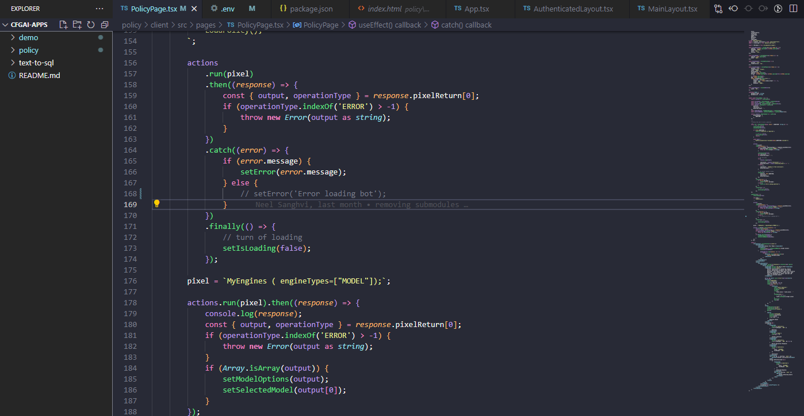
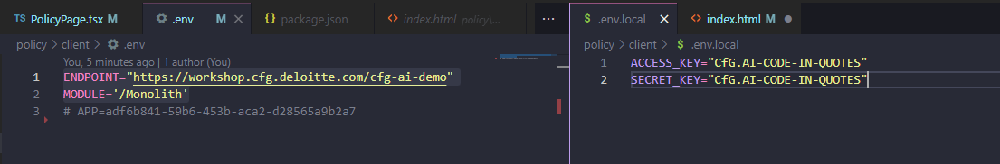
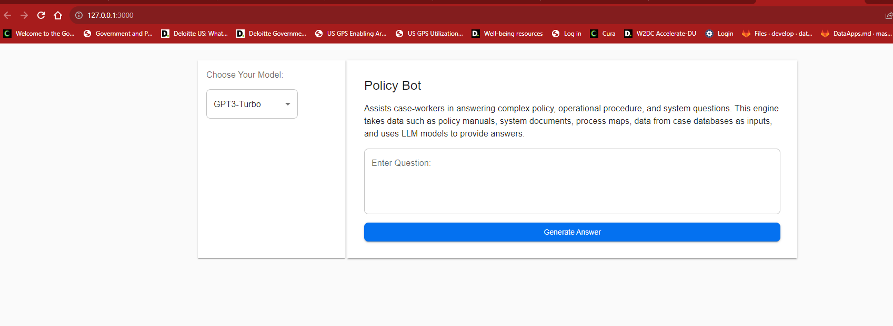
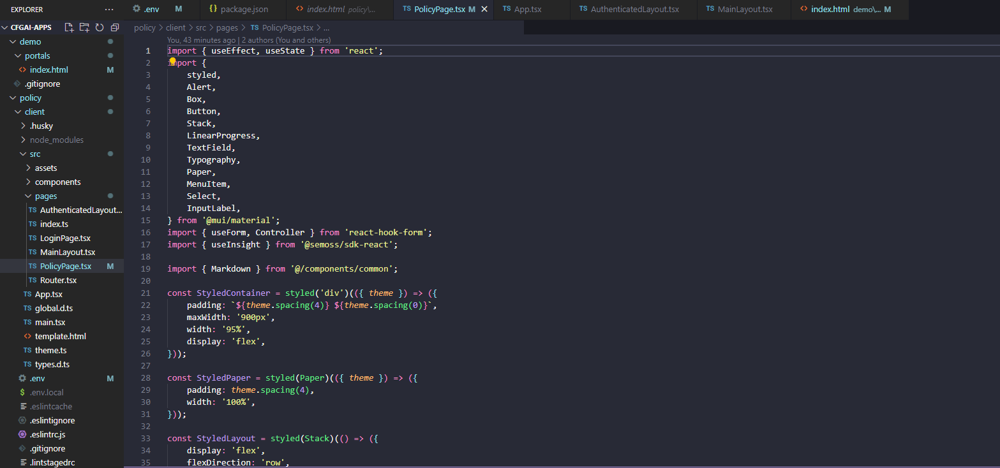

import AppName from "@site/src/components/CustomFields";


## Overview

This cookbook recipe shows you how to deploy, configure, run, customize, and publish **Policy Bot** - the frontend application for the **Policy Vector Engine**, powered by SEMOSSName’s Vector Engine to answer complex policy, operational procedure, and system‑related questions.

By indexing internal policies and procedural documents into vector embeddings, the Policy Vector Engine enables PMO teams to query documentation conversationally and receive accurate, context‑aware, citation‑supported answers. Policy Bot is the user interface that allows you to interact with that engine, turning your indexed documents into an applied, organization‑ready policy assistant.

By the end of this recipe, you will:

- Deploy and configure the Policy Bot frontend  
- Connect it to the PMO Policy Vector Engine  
- Customize its UI and workflows  
- Publish it into the SEMOSSName App Catalog  

## Setup

### Prerequisites

- [**Node.js**](../javascript-guide#nodejs) installed 
- [**VS Code**](./Guide%20for%20Building%20a%20JavaScript%20App%20(Node.js).md#code-editor) or any preferred code editor  
- **pnpm** installed globally  

  ```bash
  npm install -g pnpm
  ```

- Access to an SEMOSSName instance  
- Access to the SEMOSS Marketplace repository

### Project Setup

Clone the Marketplace repository:

```bash
git clone https://github.com/SEMOSS/marketplace.git
```

Open the `Policy Bot` project folder in VS Code:


Navigate into the `client` directory, which contains the React frontend for Policy Bot.

## Steps

1. **Create your workspace and access Policy Bot**  
   Create a folder where your Marketplace apps will live.  
   Open the **Policy Bot** folder from the repository.  

   

   Navigate into the `client` folder:  

   `cd policy/client`

2. **Install dependencies**  
   Inside the `client` directory:  

  ```bash
   pnpm install
   ```

3. **Configure environment variables**  
   Open the `.env` file inside the `client` folder and configure:
    - `MODULE`: the backend folder name for your SEMOSSName instance
    - `ENDPOINT` : The SEMOSSName host URL for local setup it would be something like `http://localhost:9090`
    - `ACCESS_KEY`: The access key for SEMOSSName *You can generate the access and secret keys from Settings > My Profile as explained in [Generating Access Keys](../Integrating%20with%20SEMOSS/ConnectingToAI.md)*
    - `SECRET_KEY`: The secret key for SEMOSSName
    - `APP`: The app ID for your pro code app. *You will either need to copy the ID from your existing app, or create an app and grab the ID.* 

   Populate the values using your SEMOSSName instance credentials and App ID.  

   

4. **Run the app locally**  
   From the `client` folder:

  ```bash
   pnpm run dev
   ```  

   The Policy Bot UI becomes available at:  
   `http://localhost:3000/`

   

5. **Customize Policy Bot**  
   Open the main page:  
  `policy/client/src/pages/PolicyPage.tsx`

   

   You can customize:
   - UI layout and display  
   - Pixel calls  
   - Prompt workflow  
   - How responses from the Vector Engine are rendered  


6. **Build the application**  
   From the `client` folder:  

  ```bash
   pnpm run build
   ```
  
   Build output is placed in the `/portals` directory.

7. **Publish the application**  
   - Zip all contents of the Policy Bot folder **except the `/client` folder**.  
     
   - Upload the zip within SEMOSSName for your app under:  
     **Edit → Settings → Data Apps → Update Project**
   - Click:  
     **Publish**  
     **Compile Changes on This Instance**
     Back in the code editor
   - You will now see the Policy Bot UI inside your App Library.  

     

## Deep Dive

This section explains how you can extend Policy Bot’s behavior at the UI level while keeping backend interactions consistent.

Policy Bot communicates with your SEMOSSName backend module through **pixel calls**, which act as request–response functions triggered from the UI.

Example:

```ts
const response = await runPixel({
  pixel: "GenerateResponse",
  params: { prompt }
});
```

You can control:

- which pixel function is invoked
- what parameters are passed
- how the returned data is interpreted and displayed in the UI

This allows you to customize the experience—responses, formatting, workflows—while relying on your existing backend module and Vector Engine configuration.

## Resources

Refer to below guides for:

- [Creating Pro Code Apps](../Building%20Apps/Pro%20Code%20Apps.md)  
- [Generating Access Keys](../Integrating%20with%20SEMOSS/ConnectingToAI.md)
