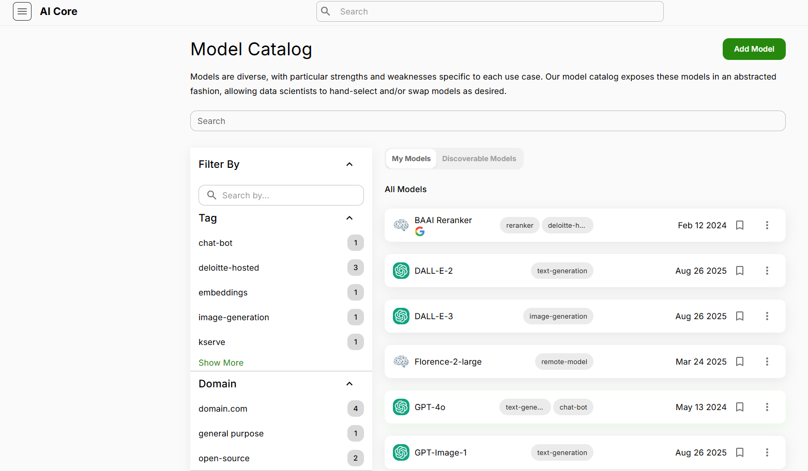
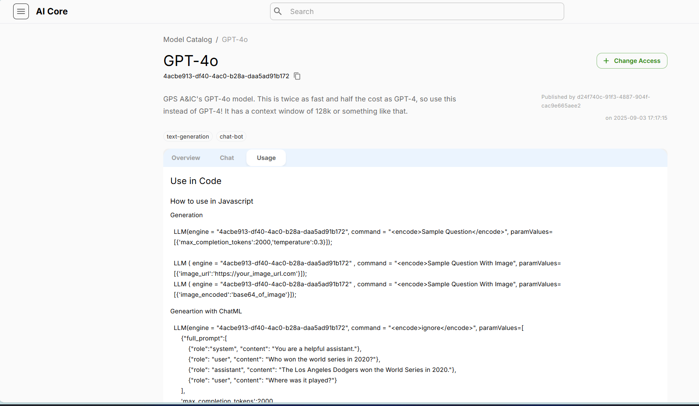
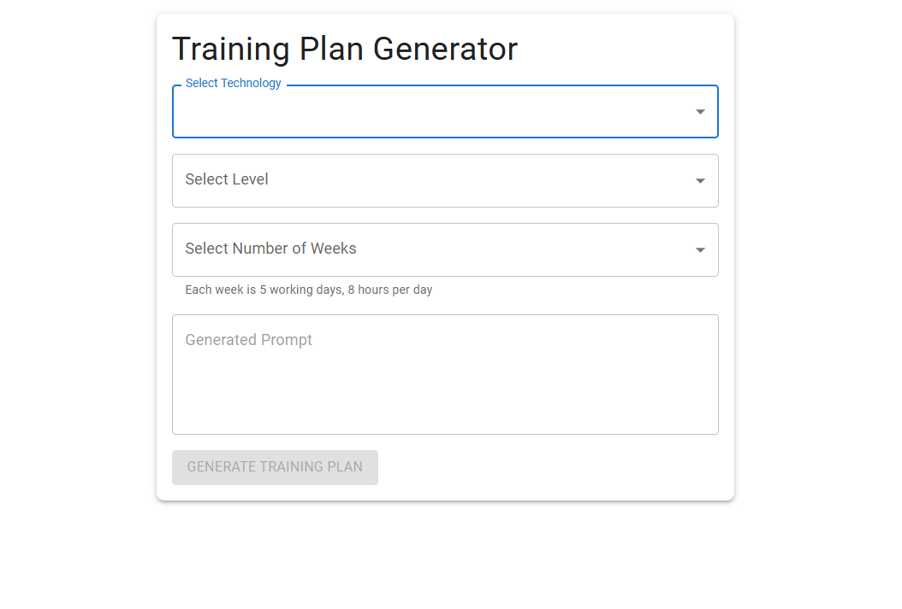
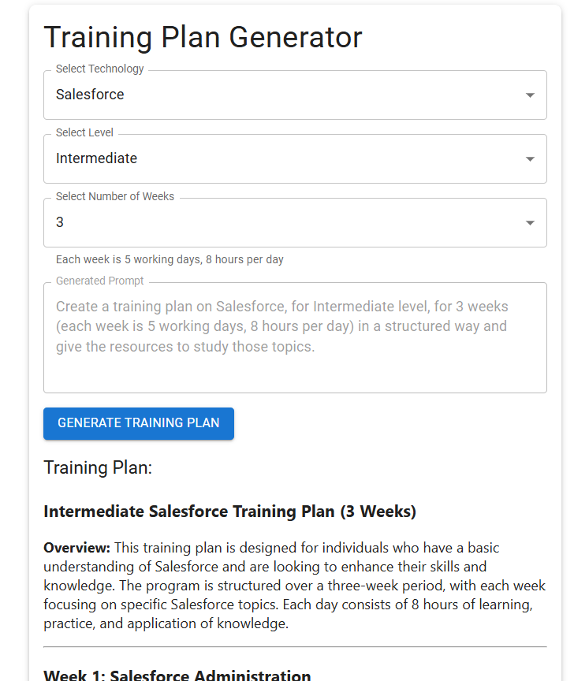

import AppName from "@site/src/components/CustomFields";


## Overview

This recipe shows you how to interact with a SEMOSS model both programmatically and through a simple front-end application.
It walks through selecting a model in the Model Catalog, using its SDK/API examples, and then applying the same interaction in a basic React app.

As part of this tutorial, you will build a Training Plan Generator application in VS Code.

This small app demonstrates how user input can be converted into a prompt, sent to a SEMOSS model, and returned as a structured response.

### Before You Begin

Before starting this cookbook recipe, we recommend reviewing the following foundational topics:

- **[Connecting to SEMOSSName](../Integrating%20with%20SEMOSS/ConnectingToAI.md)**  
  Learn how to authenticate and connect to the SEMOSSName environment, including access tokens and required configuration.

- **[Packages and Pre-requisites](../Integrating%20with%20SEMOSS/Packages%20and%20Pre-requisites.md)**  
  Understand the libraries, SDKs, and dependencies needed to run API or SDK-based model calls.

- **[Creating an SEMOSSName App Using React](../Cookbook%20Recipes/Guide%20for%20Building%20a%20JavaScript%20App%20(Node.js).md)**  
  Get familiar with the React development workflow, folder structure, and how SEMOSS apps are typically built and run.

- **[Frontend Installation](../Advanced%20Installation/Frontend%20Installation.md)**  
  This guide assumes you have already completed the general front-end installation prerequisites described in the SEMOSSName Frontend Installation documentation.

These resources ensure you have the required environment, access configuration, and development context before attempting the cookbook recipe.

## Setup

Make sure your environment is prepared for both the API/SDK examples and the React portion of the tutorial.

For the React Training Plan Generator example, complete the following:

- Install [Node.js](https://nodejs.org/en/download/) (LTS recommended)
- Install a code editor such as [Visual Studio Code](https://code.visualstudio.com/Download/)
- Confirm that `npx` and `npm` commands run correctly in your terminal

With these prerequisites in place, you can proceed directly to implementing the SDK examples and building the React application shown in this recipe.

## Steps

1. From the model catalog, select a model that is most suitable for your use case. There are many models available on the platform, and interacting with each follows the same workflow—the only difference is the unique model ID. See [model catalog](../Platform%20Navigation/Model%20Catalog.mdx) for details.


2. Click on a specific model—in this example, the **GPT-4o** model.  


3. To use this model in your code, copy the model ID: 
**`4acbe913-df40-4ac0-b28a-daa5ad91b172`**

### Using the Model ID in Code

Once you have the model ID, you can use it to interact with the model programmatically. The SEMOSS SDK and API allow you to send a prompt to the model and receive a generated response.

The examples below demonstrate how to use the model ID across JavaScript, Python, and Notebook environments.  

Each example follows the same flow: prepare a prompt, configure optional parameters, call the model, and process the response.

## Pro Code Examples

### JavaScript Example

#### **Basic Generation**

```javascript
// Generate a response from the model
LLM({
  engine: "4acbe913-df40-4ac0-b28a-daa5ad91b172",
  command: "<encode>Your question here</encode>",
  paramValues: [
    { max_completion_tokens: 2000, temperature: 0.3 }
  ]
});
```

#### **With Image Input**

```javascript
// Using an image URL
LLM({
  engine: "4acbe913-df40-4ac0-b28a-daa5ad91b172",
  command: "<encode>Your question with image</encode>",
  paramValues: [
    { image_url: "https://your_image_url.com" }
  ]
});

// Using a base64-encoded image
LLM({
  engine: "4acbe913-df40-4ac0-b28a-daa5ad91b172",
  command: "<encode>Your question with image</encode>",
  paramValues: [
    { image_encoded: "base64_of_image" }
  ]
});
```

#### **ChatML-style Conversation**

```javascript
LLM({
  engine: "4acbe913-df40-4ac0-b28a-daa5ad91b172",
  command: "<encode>ignore</encode>",
  paramValues: [
    {
      full_prompt: [
        { role: "system", content: "You are a helpful assistant." },
        { role: "user", content: "Who won the world series in 2020?" },
        { role: "assistant", content: "The Los Angeles Dodgers won the World Series in 2020." },
        { role: "user", content: "Where was it played?" }
      ],
      max_completion_tokens: 2000,
      temperature: 0.3
    }
  ]
});
```

#### **Embeddings**

```javascript
Embeddings({
  engine: "4acbe913-df40-4ac0-b28a-daa5ad91b172",
  values: ["Sample String 1", "Sample String 2"],
  paramValues: [{}]
});
```

### Python Example

```python
from ai_server import ModelEngine

# Initialize the model engine
model = ModelEngine(engine_id="4acbe913-df40-4ac0-b28a-daa5ad91b172", insight_id='${i}')

# Basic generation
question = 'Sample Question'
output = model.ask(question=question, param_dict={'max_completion_tokens': 2000, 'temperature': 0.3})

# With image input
output = model.ask(
    question='Sample Question With Image',
    param_dict={'image_url': 'https://your_image_url.com', 'max_completion_tokens': 2000, 'temperature': 0.3}
)
output = model.ask(
    question='Sample Question With Image',
    param_dict={'image_encoded': 'base64_of_image', 'max_completion_tokens': 2000, 'temperature': 0.3}
)

# ChatML-style conversation
output = model.ask(
    question='ignore',
    param_dict={
        "full_prompt": [
            {"role": "system", "content": "You are a helpful assistant."},
            {"role": "user", "content": "Who won the world series in 2020?"},
            {"role": "assistant", "content": "The Los Angeles Dodgers won the World Series in 2020."},
            {"role": "user", "content": "Where was it played?"}
        ],
        'max_completion_tokens': 2000,
        'temperature': 0.3
    }
)

# Embeddings
text_arr = ['Sample String 1', 'Sample String 2']
model.embeddings(strings_to_embed=text_arr)
```

> _**Note**: Replace the **Engine id** with the model specific to the preference or usecase._ 

### Notebook Integration (Python)

You can also interact with the model in a notebook environment:

```python
from semoss_sdk import call_model

result = call_model(model_id="your-model-id", prompt="What is the weather today?")
print(result["text"])
```

## Building a Simple React App in VS Code

Let us build a minimal React application called **Training Plan Generator**, which collects user inputs, constructs a prompt, sends it to a SEMOSS model, and renders the returned output.

### Creating the React Project

Open VS Code and run:

```bash
npx create-react-app training-plan-generator
cd training-plan-generator
```

### Adding Environment Variables

Create a `.env` file in the root directory:

```
REACT_APP_SEMOSS_API_URL=https://<your-semoss-endpoint>/v1/model/prompt
REACT_APP_SEMOSS_API_KEY=<your-api-key>
REACT_APP_MODEL_ID=<your-model-id>
```

Restart your terminal or VS Code for the environment variables to take effect.

### Adding the React Code

Replace the contents of `src/App.js` with:

````javascript
import { useState, useEffect } from "react";

function App() {
  const [technology, setTechnology] = useState("");
  const [level, setLevel] = useState("");
  const [weeks, setWeeks] = useState("");
  const [prompt, setPrompt] = useState("");
  const [trainingPlan, setTrainingPlan] = useState("");
  const [loading, setLoading] = useState(false);

  useEffect(() => {
    if (technology && level && weeks) {
      setPrompt(
        `Create a training plan on ${technology}, for ${level} level, for ${weeks} weeks ` +
        `(each week is 5 working days, 8 hours per day) in a structured way and give the resources to study those topics.`
      );
    }
  }, [technology, level, weeks]);

  const handleGeneratePlan = async () => {
    setLoading(true);

    const requestBody = {
      model_id: process.env.REACT_APP_MODEL_ID,
      prompt: prompt,
      paramValues: [
        {
          max_completion_tokens: 4096,
          temperature: 0.3
        }
      ]
    };

    try {
      const response = await fetch(process.env.REACT_APP_SEMOSS_API_URL, {
        method: "POST",
        headers: {
          "Authorization": `Bearer ${process.env.REACT_APP_SEMOSS_API_KEY}`,
          "Content-Type": "application/json"
        },
        body: JSON.stringify(requestBody),
      });

      const data = await response.json();
      setTrainingPlan(data.response || "No response received from the model.");
    } catch (error) {
      console.error("Error:", error);
      setTrainingPlan("Error generating training plan");
    }

    setLoading(false);
  };

  return (
    <div style={{ padding: "40px", maxWidth: "800px", margin: "0 auto" }}>
      <h1>Training Plan Generator</h1>

      {/* Technology */}
      <label style={{ fontWeight: "500" }}>Select Technology</label>
      <select
        value={technology}
        onChange={(e) => setTechnology(e.target.value)}
        style={{ width: "100%", padding: "10px", marginBottom: "20px" }}
      >
        <option value="">Select Technology</option>
        <option value="Salesforce">Salesforce</option>
        <option value="Python">Python</option>
        <option value="React">React</option>
        <option value="Machine Learning">Machine Learning</option>
      </select>

      {/* Level */}
      <label style={{ fontWeight: "500" }}>Select Level</label>
      <select
        value={level}
        onChange={(e) => setLevel(e.target.value)}
        style={{ width: "100%", padding: "10px", marginBottom: "20px" }}
      >
        <option value="">Select Level</option>
        <option value="Beginner">Beginner</option>
        <option value="Intermediate">Intermediate</option>
        <option value="Advanced">Advanced</option>
      </select>

      {/* Weeks */}
      <label style={{ fontWeight: "500" }}>Select Number of Weeks</label>
      <select
        value={weeks}
        onChange={(e) => setWeeks(e.target.value)}
        style={{ width: "100%", padding: "10px" }}
      >
        <option value="">Select Number of Weeks</option>
        <option value="1">1</option>
        <option value="2">2</option>
        <option value="3">3</option>
        <option value="4">4</option>
      </select>

      <p style={{ color: "#666", marginTop: "5px" }}>
        Each week is 5 working days, 8 hours per day
      </p>

      {/* Generated Prompt */}
      <label style={{ fontWeight: "500" }}>Generated Prompt</label>
      <textarea
        rows="5"
        value={prompt}
        readOnly
        style={{
          width: "100%",
          padding: "10px",
          marginBottom: "20px",
          background: "#f8f8f8"
        }}
      />

      {/* Button */}
      <button
        onClick={handleGeneratePlan}
        disabled={loading}
        style={{
          padding: "12px 20px",
          fontWeight: "600",
          backgroundColor: "#1976d2",
          color: "#fff",
          border: "none",
          cursor: "pointer"
        }}
      >
        {loading ? "Generating..." : "GENERATE TRAINING PLAN"}
      </button>

      {/* Output */}
      {trainingPlan && (
        <div style={{ marginTop: "40px" }}>
          <h2>Training Plan:</h2>
          <div style={{ whiteSpace: "pre-line", lineHeight: "1.6" }}>
            {trainingPlan}
          </div>
        </div>
      )}
    </div>
  );
}

export default App;
````

### Running the Application

Start the local server:

`npm start`

The React UI will open automatically in your browser.

The UI of this React Based app is shown below:



An example of the Training Plan Generator app after generating a sample Training plan is here. 



## Deep Dive

### Understanding Model Parameters

Model interactions in SEMOSS accept a set of optional parameters that control how the model generates responses.  
These parameters can be passed through `paramValues` in JavaScript or `param_dict` in Python.

**max_completion_tokens**  
Defines the maximum number of tokens the model can generate in its response.  
Lower values constrain output length; higher values allow longer, more detailed responses.

**temperature**  
Controls variability in the output.  

- Lower values (0.0–0.3) produce deterministic, factual responses.  
- Higher values (0.7–1.0) produce more creative or exploratory responses.

**full_prompt**  
A structured list of messages following a ChatML-style format.  
It typically includes system, user, and assistant messages.  
This allows multi-turn or context-rich conversations, rather than a single stand-alone prompt.

**image_url**  
URL of an image to be used as input for multimodal models (models that accept both text and images).  
SEMOSS retrieves and encodes the image automatically.

**image_encoded**  
A base64-encoded string representing image data.  
Use this when the image cannot be referenced by URL.

### How SEMOSS Interprets the Call

Regardless of language (JavaScript or Python), SEMOSS processes the request as follows:

- The **model ID** identifies which model to run.  
- The **prompt or command** is parsed and sent to the model’s generation engine.  
- Optional parameters (`temperature`, `max_completion_tokens`, etc.) modify the generation behavior.  
- For ChatML-style inputs, SEMOSS stitches the `full_prompt` array into an internal conversation format before sending it to the model.  
- If `image_url` or `image_encoded` is included, the model receives both text and image context.  
- The model generates a response, which SEMOSS returns as JSON.

This structure ensures that the same logic applies across all supported languages and environments, making it straightforward to move from notebooks to scripts to applications.

### React Deep Dive: How the Training Plan Generator Works

The React example shows how user inputs are transformed into a prompt, sent to a SEMOSS model, and displayed in the UI.
Below are the key code snippets explained.

#### State Management

````javascript
const [technology, setTechnology] = useState("");
const [level, setLevel] = useState("");
const [weeks, setWeeks] = useState("");
const [prompt, setPrompt] = useState("");
const [response, setResponse] = useState("");
const [loading, setLoading] = useState(false);
````

These variables track user inputs, the generated prompt, the model response, and the loading state. Each one directly controls specific UI behavior.

#### Prompt Generation (useEffect)

````javascript
useEffect(() => {
  if (technology && level && weeks) {
    setPrompt(
      `Create a training plan on ${technology} for ${level} level over ${weeks} weeks. ` +
      `Each week has 5 working days and 8 hours per day. Provide structured topics and study resources.`
    );
  }
}, [technology, level, weeks]);
````

This effect regenerates the prompt whenever form values change, keeping it synchronized with the user’s selections.

#### Model Call (callModel)

````javascript
const callModel = async () => {
  setLoading(true);

  const res = await fetch(process.env.REACT_APP_SEMOSS_API_URL, {
    method: "POST",
    headers: {
      "Authorization": `Bearer ${process.env.REACT_APP_SEMOSS_API_KEY}`,
      "Content-Type": "application/json"
    },
    body: JSON.stringify({
      model_id: process.env.REACT_APP_MODEL_ID,
      prompt: prompt
    })
  });

  const data = await res.json();
  setResponse(data.response || JSON.stringify(data, null, 2));
  setLoading(false);
};
````

This function sends the user-generated prompt to the SEMOSS model using values stored in .env.
The returned JSON response is stored in state so the UI can display it.

#### Rendering Output

````javascript
<textarea
  rows="12"
  cols="80"
  value={response}
  readOnly
/>
````

With these pieces in place, the app completes the full interaction cycle: user inputs generate a prompt, the SEMOSS model processes it, and the resulting training plan is rendered directly in the interface.
