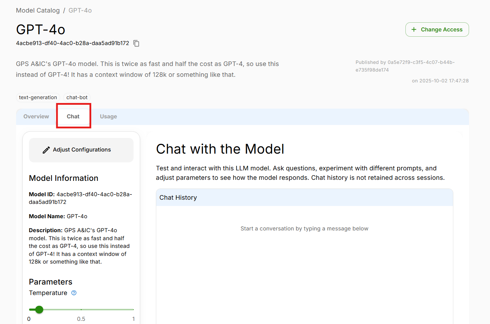
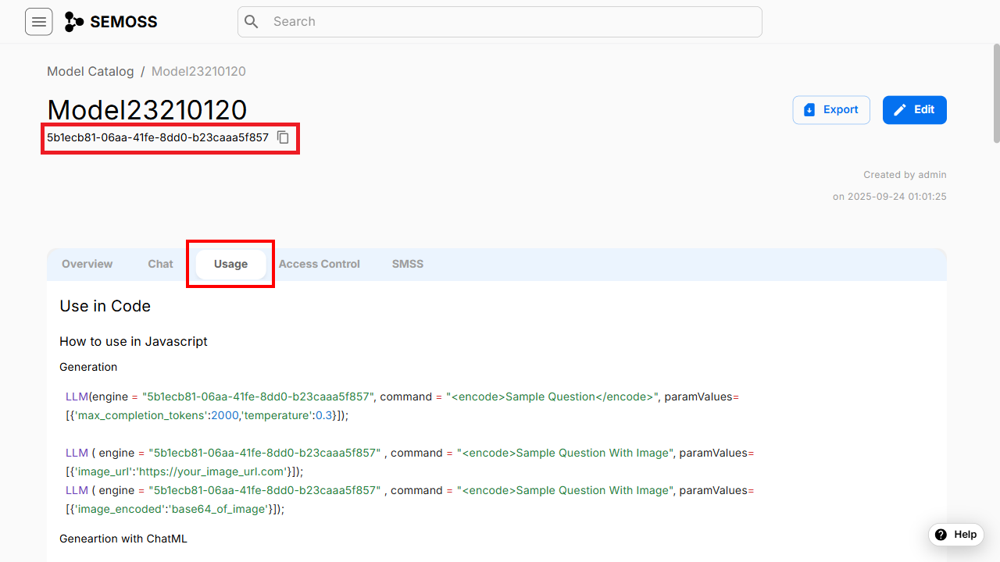
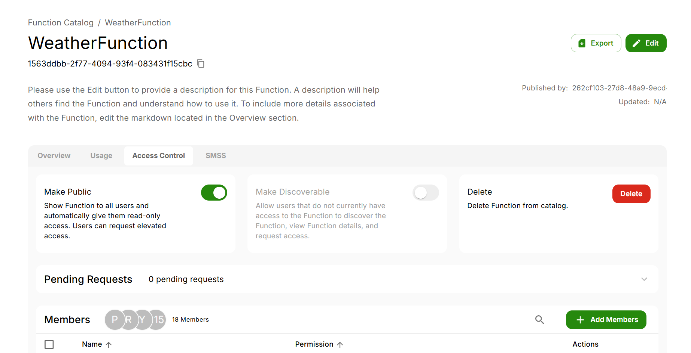

import ReactPlayer from "react-player"
import AppName, {ShowVideoTag, WrapVariable} from "@site/src/components/CustomFields";

# Model Catalog

Models are Large Language Models (LLMs), a type of Artificial Intelligence (AI) algorithm that leverages deep learning techniques and vast datasets to understand, summarize, generate, and predict new content. Gen AI Apps created on SEMOSSName are built upon these advanced models.

<ShowVideoTag><ReactPlayer controls url="/Demos/ModelsDemo.mp4" /></ShowVideoTag>

To connect to existing model or add new models, click on the **model** icon on the left side of SEMOSSName portal to access the Model catalog.

The Model catalog displays a list of LLMs that are already accessible to you. If you do not have any existing LLMs in your current model catalog, you can go to **Discoverable models** to browse through the available models and request access:

## Adding a Model
Click on **Add Model**, choose your preferred model from the list and fill in the required details to connect to the model.

> _Various Model Options_

{/* <ReactPlayer controls url={ModelCatalog} /> */}

Each tab of the model has distinct characteristics:

**Commercially-hosted Models -** Managed by an external vendor, these models come with a subscription or licensing fee. The vendor handles hosting and maintenance, offering highly scalable and customizable solutions. The model groups that fall under this include:

- **OpenAI**
- **Azure**
- **AWS Bedrock**
- **Google GCP**
- **NVIDIA NIM Models**

**Locally-hosted Models -** Installed and managed on the organization's own servers, these models also come with a subscription or licensing fee. This setup gives the organization full control over the model, allowing for extensive customization to meet specific requirements.  

**Embedded Models -** Integrated with other software or platforms, these models focus on specific functions and can be seamlessly blended into existing systems.

## Model Chat
You can test and interact with this LLM model with our Chat tab, as shown.

On the left hand tab, you can adjust the configurations:
- *Temperature* - This changes the randomness of the LLM's output. The higher the temperature the more creative and imaginative your answer will be. Range: 0.0 to 1.0
- *Max Tokens (Output)* - This controls the maximum number of tokens in the response. Higher values allow for longer responses but may take more time. Default: 2000

Finally, within the chat, you can retain chat history and reference previous prompts as shown in the below example, similar to ChatGPT. However, chat history is not retained across sessions.

## Usage
The usage tab for a model tells you how to use the model in JavaScript, Python, Langchain API, Java and also how to use externally with OpenAI API and our Python SDK.

## Getting the Model ID

Every model in SEMOSS is assigned a unique **Model ID**.  
This ID is required when you use the model programmatically in JavaScript, Python, or other supported SDKs.

You can find the Model ID in two locations:

###  In the Model Overview Page
When you open a model from the **Model Catalog**, the Model ID appears directly under the model name along with a **Copy Model ID** button.

This is the primary location for retrieving the ID.

### Inside the Usage Tab**
The Model ID is also shown inside the code examples under the **Usage** tab.

These examples automatically include the correct Model ID so you can copy–paste them directly into your application.

## Access Control

The Access Control tab allows authors of the model to change model permissions

### Add members
You can grant access to other users by clicking on Add Member. When adding a member you will have to select which [permission level](./Settings/Permissions.mdx) to grant.

### Pending Requests
Users can request access to your model if it is  [Discoverable](#discoverable-models), these requests will be visible in Pending Requests. 

### Public Model
Making a model public allows all users to have READ-ONLY access to the model. Users would also be allowed to request access to the model.

### Discoverable Models
Making a model discoverable allows all users to request access to the model.
[Request Access for Discoverable Models](#discoverable-models)

If a model is discoverable other users can request access to the model.

Click on **Request Access** near the top-right corner and a pop-up will provide you with 3 options to choose from - Author, Editor & Read-Only. You can choose the option based on your role and request.

## Edit Model
This allows you to edit the model metadata displayed in the Overview tab for the model. It provides a convenient way to update details, correct errors, or enhance information as needed. By clicking this button, users can access editable fields and make changes before saving or submitting their updates. This functionality helps maintain accurate and up-to-date content.

  - Edit Model Options
    - Edit/View Tabs: The "Edit" tab is for entering or modifying content, while the "View" tab allows users to see how the content will appear once formatted.
    - Description: A field for providing a detailed explanation of the model, helping others understand its purpose and usage.
    - Tag: Allows users to add tags for categorization or easy searching, enhancing the discoverability of the model.
    - Domain: Users can specify the domain or area of application for the model, aiding in contextual understanding.
    - Data Classification: A input field for specifying the classification of data, which can be important for compliance and security purposes.
    - Data Restrictions: This field is for noting any restrictions on the data, such as access limitations or usage guidelines.

## Export Model
The **Export** button allows users to download the current content as a ZIP file, making it easy to save and share multiple files in a compressed format. This feature streamlines the process of exporting data for backup, collaboration, or offline use. By clicking the Export button, users can quickly package their work and transfer it efficiently. This zipped file can be uploaded in other SEMOSSName enviornments.

## Delete Model
Authors can permanently delete a model.
